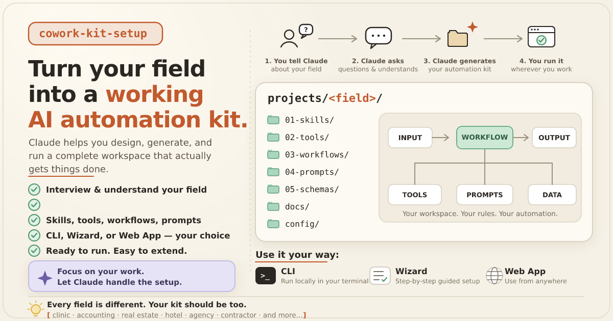

# Cowork Automation Generator

<p align="center">
  
</p>

Name a field → **Claude** interviews you, then designs, builds, sets up, runs, and
fixes an automation kit for it. The user just talks; Claude does the technical
parts. Every generated kit lands in **`projects/<field>/`**, ready for Cowork.

New here? Read **[CARA-PAKAI.md](CARA-PAKAI.md)** (plain-language guide).

## In plain words

Cowork is Claude working directly on your computer — reading files, writing
documents, tidying up your work. **cowork-setup turns that generic Claude into a
worker for your specific job.** Tell it what you do (accountant, real-estate
agent, clinic…); it asks a couple of questions, then builds a ready-made
automation kit for your field in `projects/<field>/` and runs it. No coding, no
terminal. Two ways in: chat with Claude in Cowork, or click through the local
wizard form. Claude drafts; you approve anything that gets sent or published.

## Two ways to use it

1. **Talk to Claude in Cowork** (main path). Install the skill, say what you do
   (*"I'm an accountant, set up Cowork for me"*). Claude interviews you and builds
   `projects/<field>/` — and operates it for you.
2. **Wizard GUI** (no Cowork, no install). Run `node wizard/server.mjs`, open the
   form, and it creates `projects/<field>/` for you. Then open that folder in Cowork
   and run the skill so Claude adds field-specific tools and runs them.

## What lands in `projects/<field>/`

- **In-Cowork ops skill** (`.cowork/skills/<field>-ops/`) — zero setup, runs in Cowork.
- **Local Python CLI** (default) — headless/scheduled runs; one Anthropic API key.
- **Per-project webapp** (Next.js + Convex + BYOK) — **opt-in**; a shareable app
  that runs the automation in the browser (needs a Convex account).

One contract powers them all: `automation.config.json` (tool names, schemas, system
prompt, workflows). Surfaces never drift.

## Repo layout

```
cowork-setup/
├── .claude-plugin/plugin.json          # installs the generator as a plugin
├── skills/cowork-automation-generator/ # THE generator (skill + references + scaffolder + templates)
├── agents/automation-architect.md      # subagent that researches + designs a domain config
├── wizard/                             # zero-dep local GUI: form -> creates projects/<field>/
├── projects/                           # your generated kits land here (one per field)
├── scripts/                            # verify.py, check_web.py (CI)
└── cowork-automation-generator.skill   # packaged, installable bundle
```

## Wizard (GUI generator)

```bash
node wizard/server.mjs      # then open http://localhost:4321
```

No `npm install`. Needs Node 18+ and Python 3 (it calls the scaffolder). Fill the
form → it writes `projects/<field>/` with the core tools. Details: `wizard/README.md`.

## Advanced: run the scaffolder yourself

```bash
# default surfaces (in-Cowork skill + local CLI) -> projects/<slug>
python3 skills/cowork-automation-generator/scripts/scaffold.py --domain "real estate"

# add the opt-in per-project webapp
python3 skills/cowork-automation-generator/scripts/scaffold.py --domain "real estate" --web

# from a full design Claude produced, to a custom path
python3 skills/cowork-automation-generator/scripts/scaffold.py --config design.json --out projects/real-estate
```

`--dry-run` previews; `--force` overwrites; `--surfaces cowork,cli,web` selects surfaces.

## Run a generated kit

The generated `projects/<field>/README.md` has the exact steps. Short version:

```bash
# local CLI
cd projects/<field>/local && python -m venv .venv && source .venv/bin/activate
pip install -e . && cp .env.example .env   # add ANTHROPIC_API_KEY
automation doctor && automation run "Process the newest item in ./inbox"

# per-project webapp (only if generated with --web)
cd projects/<field>/web && npm install && npx convex dev   # keep running
npm run dev                                                 # paste your Anthropic key in the UI
```

## Develop

```bash
python3 scripts/verify.py                                  # JSON, py_compile, config<->py<->ts, scaffold dry-run
python3 scripts/check_web.py skills/cowork-automation-generator/assets/templates/web   # Convex wiring
node --check wizard/server.mjs                             # wizard syntax
```

CI runs these on every push (`.github/workflows/ci.yml`). See `CONTRIBUTING.md`.

## Design principles

- **Claude operates, the user talks.** The deliverable is a working thing, set up
  and run for the user — not a pile of files they must wire up.
- **Output lives in `projects/`.** One Cowork-ready folder per field.
- **Deterministic work in tools, judgement in prompts.**
- **Guardrails before power.** Irreversible/external actions human-approved; folder
  access scoped; secrets never in prompts; webapp is BYOK.
- **Default light, scale on demand.** Cowork skill + CLI by default; webapp opt-in.

## FAQ

**Do I need to know how to code?**
No. Install the skill and tell Claude your field — e.g. *"set up Cowork for my dental clinic"*. Claude interviews you, builds the kit in `projects/`, runs it, and fixes errors itself. Plain-language guide: [CARA-PAKAI.md](CARA-PAKAI.md).

**What's the difference between the wizard and the skill?**
Same outcome (a `projects/<field>/` folder), two interfaces. The **skill** is Claude interviewing you in Cowork (and it implements + runs everything). The **wizard** (`node wizard/server.mjs`) is a click-through form for people who'd rather not chat — it creates the folder with core tools; open it in Cowork afterward for the field-specific tools.

**Where do generated projects go?**
`projects/<field>/`. They're gitignored by default (they're yours, not part of the template).

**Do I need an Anthropic API key?**
In-Cowork: no. Local CLI: one `ANTHROPIC_API_KEY` (Claude asks once, stored in `.env`). Webapp: BYOK — each user pastes their own key.

**Does it cost anything?**
Claude usage is billed to whichever key runs it. The optional webapp uses Convex (free tier). The generator and wizard are free.

**`npm i` fails at the repo root.**
The root isn't a Node project. The wizard runs with `node wizard/server.mjs` (no install). npm only applies inside a generated `projects/<field>/web` if you opted into the webapp.

**The webapp shows `Server Error` on a query.**
Convex hasn't pushed the schema yet. In that project's `web/` run `npm run setup` (alias for `npx convex dev`) and keep it running, then `npm run dev`. Claude does this for you. More: the project's `web/README.md` → Troubleshooting.

**Two "webapps" — which is which?**
The **root wizard** (`wizard/`) *creates* project folders. The **per-project webapp** (`projects/<field>/web/`) *runs* one project's automation in the browser (BYOK, opt-in).

**Some generated tools say `TODO`.**
Domain-specific tools are scaffolded as stubs so the project validates immediately. Claude implements them; they live in `projects/<field>/local/automation/tools.py` (and `web/lib/tools.ts` if built).

**Is my API key safe?**
CLI keys live in `.env` (gitignored). The webapp is BYOK, stored per session in Convex, never logged. Never paste keys into chat.

**macOS or Windows?**
Both — Cowork runs on macOS and Windows.

**How do I update the generator?**
Re-install the latest `cowork-automation-generator.skill` (Settings → Skills) and pull the repo for the newest templates/scaffolder/wizard.
