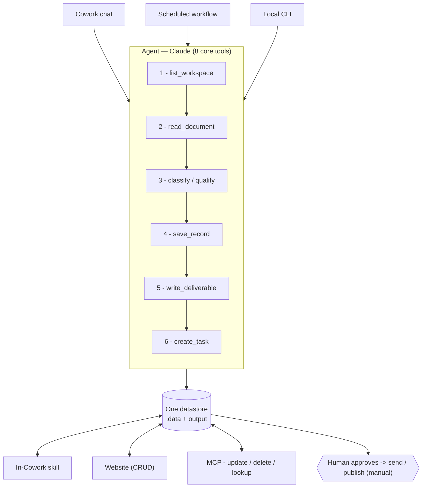

# Flow — the universal use-case

Almost every field a cowork-setup project targets shares one loop:
**intake → record → draft → follow-up**. Only the table names and the drafted
document change. This is the `process-inbox` workflow every generated project ships
with, built from the 8 core tools.

## Scenario (real estate, but identical elsewhere)

A lead lands as `./inbox/lead-jane.txt`. You tell Cowork *"process the inbox"*. The
agent runs `list_workspace` → `read_document` → qualifies it → `save_record` into
the `leads` table → `write_deliverable` drafts a reply into `./output` (not sent) →
`create_task` for a 24-hour follow-up. Later the status changes via `update_record`
and you recall history with `lookup_record`. You approve the draft and send it
yourself.

## Why it's the most cross-field use-case

| Field | Intake | Table (`save_record`) | Draft (`write_deliverable`) | Follow-up (`create_task`) |
|---|---|---|---|---|
| Real estate | new lead | `leads` | reply / offer | call in 24h |
| Interior design | client brief | `projects` | proposal | send proposal |
| Support | ticket | `tickets` | reply | escalate |
| Clinic | new patient | `patients` | confirmation | reminder |
| Accounting | invoice | `invoices` | summary | schedule payment |
| HR | applicant | `applicants` | screening note | schedule interview |

Same tools throughout: `list_workspace · read_document · save_record ·
write_deliverable · create_task` (plus `update_record` / `lookup_record` on
follow-up).

## One datastore, three surfaces

The CLI, the local website, and the MCP server all read/write the same
`.data/*.jsonl` + `output/`. So a record created in chat shows up on the website
instantly, and Claude can edit it later through the MCP — one source of truth.
Irreversible or external actions (send, publish, `delete_record`) always wait for
human approval.
